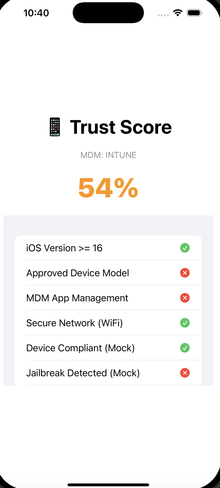

# TrustScore Mobile - Context-Aware Posture Scoring

## Overview

Traditional mobile app security in the enterprise space often relies on surface-level protections—SSL pinning, VPN tunnels, and traffic inspection. But these approaches don't account for the actual security **posture** of the device. They're reactive and limited by what can be done inside the app sandbox.

**TrustScore Mobile** changes that. Instead of trying to "secure" the OS, we combine **real-time SDK signals** from native MDMs like **Microsoft Intune** and **Workspace ONE**, with **backend MDM API calls** (Graph API for Intune and REST API for WS1) to build a complete, unified picture of a device’s posture. This generates a dynamic **Trust Score (0–100)** that the app can use to make real-time access decisions.

## Why This Matters

On-device SDKs are powerful—but they can't access everything.

A device might be marked as compliant, but unless you also check the **configuration profile details** (like whether a passcode is enforced, how complex it is, or if certificates are being required), you’re only seeing part of the story.

TrustScore Mobile bridges that gap by calling backend MDM APIs to evaluate the actual enforcement policies alongside what the device reports locally.

## Core Idea

1. Embed MDM SDKs (Intune, Workspace ONE, etc.) for live telemetry
2. Use MDM APIs (Graph API, WS1 REST) to pull enforced profile configurations
3. Combine these into a **weighted scoring matrix**
4. Deliver a trust score for use within the app:
   - ✅ Block or allow access
   - 🔐 Trigger step-up MFA
   - 🚫 Disable high-risk app features
   - 📊 Report to SIEM/SOC for auditing

## Architecture Flow

```text
User Device
┌────────────────────────────┐
│        Mobile App          │
│ ┌────────────────────────┐ │
│ │ TrustScore SDK         │ │
│ │ - Intune SDK Wrapper   │ │
│ │ - Device Signal Parser │ │
│ │ - Scoring Engine       │ │
│ └────────────────────────┘ │
└─────────────▲──────────────┘
              │
              │ Trust Score + Metadata
              ▼
       ┌───────────────┐
       │ Backend API   │
       │ - Score Store │
       │ - Graph + WS1 │
       │ - SIEM Feeds  │
       └───────────────┘
              │
              ▼
        SIEM / Dashboard
  (Sentinel, Splunk, WS1, etc.)
```

## Sample Scoring Matrix

| Source                 | Attribute                            | Weight | Notes                              |
|------------------------|---------------------------------------|--------|-------------------------------------|
| Intune SDK             | Jailbroken/Rooted                    | 5      | Critical risk                      |
| Intune SDK             | OS Patch Compliance                  | 3      | Moderate risk                      |
| Intune SDK             | Device Encryption Enabled            | 2      | Required                           |
| Intune SDK             | PIN/Biometric Configured             | 2      | Triggers MFA if absent             |
| Intune SDK             | App Protection Policy Applied        | 4      | Major control signal               |
| Graph API              | Passcode Complexity Enforced         | 4      | Pulled from config profile         |
| WS1 REST API           | Cert/VPN/WiFi Profile Configured     | 3      | Confirms cert-based auth required  |
| Custom Signal (local)  | Network Type (e.g., Public Wi-Fi)    | 1      | Optional risk signal               |

Trust Score = normalized weighted total (scale: 0–100)

## 📱 Screenshot



## Integrated SDKs

- [Microsoft Intune App SDK for iOS](https://github.com/microsoftconnect/ms-intune-app-sdk-ios)
- [Workspace ONE SDK for iOS](https://github.com/euc-releases/iOS-WorkspaceONE-SDK)

These SDKs provide real-time local signals, while backend API integrations allow visibility into enforced policies—creating a full 360° view of device trustworthiness.

## MVP Goals (Q2 2025)
- [x] Intune SDK wrapper in native Swift
- [x] Local scoring engine with config file
- [ ] REST API backend to expose Trust Score
- [ ] Basic dashboard to view active posture stats

## Phase 2+ Features
- Workspace ONE + MaaS360 SDK support
- Graph API integration for real-time config retrieval
- WS1 REST API integration
- Splunk/WS1 Intelligence webhook integration
- Admin UI to manage scoring templates
- Step-up auth trigger integration
- Android parity (Play Integrity + MDM APIs)

## Final Thought

Most mobile security tools chase shadows. This concept chases **real posture signals**—both local and backend.

By combining on-device SDK telemetry with remote API insights from MDM control planes, we can finally quantify and act on mobile trust context without violating OS boundaries.

This makes mobile access policy both enforceable and adaptable. Let’s stop pretending we can inspect every packet—and instead act on the posture truth already available to us.

